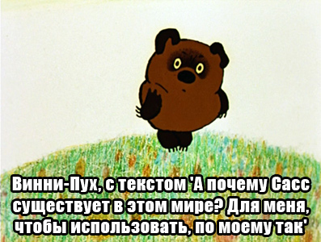
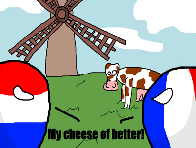
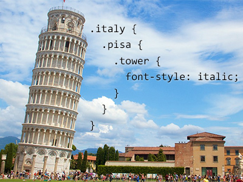

##Scout-App Cultures & Translations

The source of truth for Scout-App translations is this [Google Sheet](https://docs.google.com/spreadsheets/d/16FtHGThz0-CBz_rf_9QO4zOV7oNmNk2BlwmtvKuzAhs/edit?usp=sharing).

If you would like to translate Scout-App, edit that file and create an Issue on github informing us of the change.

By translating the app you get to pick what image is displayed for that language. It should be something culturally significant to native speakers.

For more information:

* http://scout-app.io/index.html#cultures

* * *

##Memes

Scout-App wants to show a personal touch for each culture. So we attach some culturally relavent image with some Sass or CSS reference in it.

Examples:

### America

King of the Hill is an American cartoon set in Texas following Hank Hill. He is known for saying "I sell propane and propane accessories".

### Russia

Vinni Pukh is a strange Russian adaptation of Winne the Pooh. He is a bit more existenstial, asking questions like "And why does honey exist? For me to eat it - I think so". So in this translation he is saying "Why does Sass exist? For me to use, of course!"

### Dutch

This is from a webcomic called "[Scandinavia and the World](http://satwcomic.com/the-whale-in-the-room)". It features Netherlands and Denmark. The translation reads "Do you think my sass file is too big? - That is literally a whale".

### Italy

This is the Leaning Tower of Pisa from Italy with some CSS being applied to cause it's famous slant.

